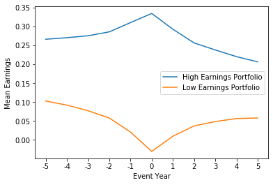
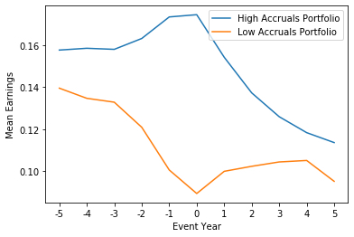

# Do Stock Prices Fully Reflect Information in Accruals and Cash Flows about Future Earnings?
## Replicating (Sloan 1996)

Using data from Wharton Research Data Services (WRDS) we recreate the findings of Richard G. Sloan (Jul., 1996) and confirm that, in the second half of the 20th century, stock prices did not reflect information about future earnings contained in the accrual component of current earnings, thus identifying a market anomaly. 

By extending the analysis to the previous decade, we see that the Accruals Annomaly did not persist into the present day.

### Symmetry Observed in Top Decile vs Bottom Decile Grouped by Overall Earnings

### Asymmetry Observed in Top Decile vs Bottom Decile Grouped by Accruals

### Original Paper
https://econ.au.dk/fileadmin/Economics_Business/Education/Summer_University_2012/6308_Advanced_Financial_Accounting/Advanced_Financial_Accounting/2/Sloan_1996_TAR.pdf

### Data Source
https://wrds-www.wharton.upenn.edu/login/?next=/search_variables/

